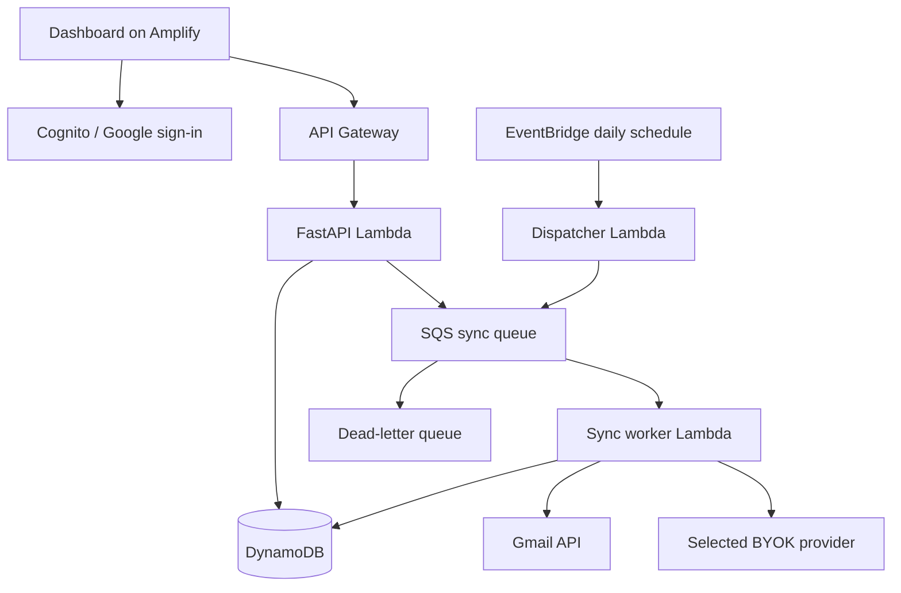

# Application Tracker — AWS Technical Design

Status: Proposed; accompanies [PRD](PRD.md)
Date: 2026-09-11

## Architecture

Use a static React/TypeScript dashboard on AWS Amplify Hosting, a Python FastAPI API on Lambda through API Gateway, and DynamoDB on-demand tables. Amazon Cognito federates Google sign-in. Gmail authorization is a separate server-side OAuth flow requesting read-only access and offline authorization.

EventBridge Scheduler invokes a dispatcher daily. The dispatcher pages through connected accounts and enqueues sync tasks in SQS. A worker Lambda processes bounded batches and enqueues continuations. This avoids running a whole 90-day import inside an HTTP request or one Lambda invocation.

Use AWS SAM/CloudFormation for backend infrastructure, with Amplify hosting configuration documented alongside it. Proposed region: us-east-1, subject to account and residency preferences. Keep Lambdas outside a VPC initially so internet API access does not require a NAT gateway. Limit concurrency and configure AWS budget alerts before deployment; no cost estimate is promised without workload and current pricing review.

## Identity and authorization

Use a Cognito user pool with Google federation and authorization-code flow with PKCE for the browser. API Gateway validates access tokens; the API derives ownership from the verified subject, never a request-supplied user ID. Restrict CORS to deployed frontend origins.

Connecting Gmail uses a separate Google OAuth web-server client and single-use state tied to the signed-in user, with a short expiry. Redeem authorization codes only on the backend, request offline access, and preserve an existing refresh token when Google does not issue a replacement. Verify the connected Gmail identity matches the sign-in email for the initial one-account scope. Cognito sign-in alone does not provide durable Gmail permission.

The callback consumes state atomically and redirects without tokens in the URL. Return only connection status and masked provider-key metadata to the browser. Never put refresh tokens or BYOK secrets in local storage.

## Storage

Prefer explicit tables rather than a generalized data framework:

| Table | Keys and content |
|---|---|
| Users | User subject; preferences, connection state, encrypted credentials, deletion flag, daily AI usage |
| Applications | User subject + application ID; fields, field provenance, last event time, per-field correction timestamps, version |
| Events | User subject + Gmail message ID (manual events use generated IDs); extraction outcome, evidence, application link, review state, before/after values |
| SyncRuns | User subject + run ID; fixed import boundary, cursor, counts, failures, checkpoint, lease expiry |
| OAuthStates | Hashed random state; user binding and short TTL, atomically consumed |

Use a Users index for connected-account enumeration. Apply pagination throughout. Gmail message IDs are scoped by user. Use DynamoDB conditional writes/transactions for event deduplication, application mutation, and revision history so a retried job cannot create a second application before recording the first event. Store rejected and ignored outcomes to avoid repeated proposals.

Use KMS envelope encryption for per-user refresh tokens and API keys, binding encryption context to user ID and credential type. Keep the application's Google client secret in Secrets Manager. Worker/API roles get only necessary table and KMS permissions. Credentials are never returned after saving.

## API boundaries

- `GET/POST /applications`; `GET/PATCH/DELETE /applications/{id}`.
- `GET /applications/{id}/events`.
- `POST /applications/{id}/merge` with the duplicate ID, expected versions of both records, and explicit resolutions for conflicting fields; the path ID is retained.
- `GET /reviews`; `POST /reviews/{id}/resolve` with accept/edit/reject/attach/create action.
- `POST /gmail/connect`; `GET /oauth/google/callback`; `DELETE /gmail/connection`.
- `GET /settings`; `PUT/DELETE /settings/ai` (one active provider/key).
- `POST /syncs`; `GET /syncs/latest`.
- `DELETE /account`.

Manual merges verify ownership and expected versions of both applications and require explicit conflict resolutions. Atomically mark the duplicate as merged into the retained record and record the merge event. Preserve event provenance and expose both histories through the retained application; resolve merged IDs during matching and review so replay cannot recreate the duplicate. Reject self-merges and stale requests; conditional writes prevent concurrent merge cycles.

Use optimistic versions for user edits and review resolution. POST sync returns 202 with run ID or an existing active run. Validate all input schemas, enforce owner access, and avoid returning raw upstream exception bodies.

## Sync and recovery

1. Dispatcher enumerates connected, non-deleting accounts and queues idempotent daily jobs.
2. Worker acquires a conditional per-user lease; manual and daily sync share the same lock.
3. Initial import uses a fixed 90-day Gmail search boundary and pagination. Candidate queries cover acknowledgments, assessments, interviews, offers, and rejections; exclude spam/trash initially. These filters are a documented recall limitation.
4. After import, use Gmail history IDs for incremental changes and inspect new messages. Persist a history checkpoint only when all preceding work has a durable outcome.
5. If a history ID is stale, rescan from the last successful sync time with overlap, using pagination and the same deduplication. Do not reset to a 90-day window that could silently miss a longer outage.
6. Decode plain text/HTML safely, strip quoted duplicates when possible, and limit content size. Fetch only the relevant thread context needed for classification. Never execute HTML or follow email links automatically.
7. Apply rules; invoke AI only when necessary and within the atomic per-user request budget. Resolve event ordering and application identity before mutation.
8. Persist an applied, ignored, review-required, or retryable outcome. Continue unfinished batches through the queue with durable checkpoints before approaching Lambda limits.
9. Retry transient Gmail/provider failures with backoff and bounded attempts. Permanent credential errors expose reconnect/key-replacement state. SQS redrive and alarms handle exhausted jobs; provider errors can produce reviewable events without halting rules.

DynamoDB commits and SQS sends are not atomic. Pending continuation state remains durable; a recurring recovery pass re-enqueues expired leases/incomplete continuations. Message delivery is at least once, and all consumers must be idempotent. Configure queue visibility above worker execution time and use partial batch failure handling.

Recheck connection/deletion generation before external calls and commits. Disconnect/delete increments that generation so stale queued work is discarded. Account deletion first disables work, then removes user partitions and Cognito identity. Application deletion keeps a minimal message-ID tombstone until account deletion to prevent an overlapping rescan from recreating it; disclose this behavior in the UI.

## Classification and reconciliation

Rules emit typed candidate fields, source evidence, and a reason. A null extracted status is never defaulted to Applied. For a candidate with no established stage, persist a review item without creating a new application; if an application already matches, leave its status unchanged. Independently supported non-status fields can still be reconciled. Strong application identity is a prerequisite for automatic mutation; company-name equality is insufficient. Existing thread links and requisition IDs take precedence; conflicts go to review.

Provider adapters implement one small extraction interface for OpenAI, Anthropic, and Gemini. Validate provider-specific outputs into a common schema with nullable company/role/type/season/year/status fields and evidence spans. Pin tested model IDs in deployment configuration; verify structured-output support and data handling for those models before shipping.

Treat email text as untrusted data. Extraction calls have no tools, cannot choose destinations, cannot modify credentials, and never receive other users' data. Do not trust instructions embedded in email or a model's self-reported confidence. Validate evidence against supplied content; uncertainty or conflicts require review.

Manual corrections record a per-field correction timestamp and provenance rather than a permanent lock. Existing or replayed evidence cannot overwrite a correction. A later email with a clear application match and supporting evidence may update the field; compare the email receipt timestamp with the correction timestamp, not the time the worker processes it. Ambiguous ordering or contradictory evidence goes to review. Store event time separately from ingestion time; old messages can enrich history without regressing current status. Terminal-state reopening requires review. Missing cycle values remain null.

## Operations and verification

CloudWatch logs contain request/run identifiers, counts, duration, and sanitized error categories; retention is 14 days. Alarm on dead-letter messages, dispatcher/worker failures, and repeated sync failures. Do not log email bodies, evidence, model prompts/responses, secrets, or full upstream exceptions.

Tests must cover parser fixtures, cycle extraction, unknown-stage review and status preservation, role collisions, event ordering, correction replay protection and later updates, duplicate merges and replay protection, review actions, malformed AI output, prompt injection, key failures, daily caps, queue duplication, interrupted continuations, account deletion races, and cross-user authorization. Use provider stubs for automated tests and synthetic emails only in the public repository.

Maintain an agent-authored synthetic classification suite with expected fields, application identity, and automatic/review/ignore outcomes. Use fixed fixtures and provider stubs in CI; live provider evaluation is a separate, explicitly configured run. Measure automatic-update precision separately for rules and each enabled provider, counting any incorrect application association or changed field as an incorrect update. Report counts, uncertainty, and automatic-processing coverage; zero automatic updates means unmeasured precision.

The PRD targets are 98% automatic-update precision and 90% end-to-end relevant-email recall. Measure recall against a labeled sample that includes candidate-search misses and non-application mail. Use an authorized, separately labeled held-out real-email sample before claiming real-inbox accuracy; synthetic results alone do not establish it. Keep real data and labels out of Git and do not use the held-out sample to tune rules or prompts. Record provider/model and rule versions for reproducibility. Until this evaluation exists, report real-email quality as unmeasured.

Deployment verification includes Google sign-in, separate Gmail consent, one real 90-day test-account import, repeat-sync deduplication, scheduled execution without a browser, revoked-token recovery, and deletion. CI runs backend/frontend checks and validates infrastructure templates. No live integration should be labeled tested before credentials and an AWS deployment exist.

## Public launch dependencies

Google Cloud configuration is required even though hosting is on AWS. The restricted Gmail scope and server-side processing require reviewing applicable verification/security assessment obligations and Google Limited Use rules, including AI-provider handling. Testing-mode Gmail refresh tokens generally expire after seven days. A public source repository is independent of whether the hosted app is approved for public Gmail access.

Launch also requires provider data-policy review, privacy/deletion pages, verified OAuth domains/redirects, AWS budget and concurrency settings, model selections, and live end-to-end checks. Start with designated test accounts while completing these tasks.

## References

- [Cognito authentication with external providers](https://docs.aws.amazon.com/cognito/latest/developerguide/cognito-how-to-authenticate.html)
- [Scheduled Lambda invocation](https://docs.aws.amazon.com/lambda/latest/dg/with-eventbridge-scheduler.html)
- [Google server-side OAuth and offline access](https://developers.google.com/identity/protocols/oauth2/web-server)
- [Gmail synchronization](https://developers.google.com/workspace/gmail/api/guides/sync)
- [Gmail scopes and verification](https://developers.google.com/workspace/gmail/api/auth/scopes)
